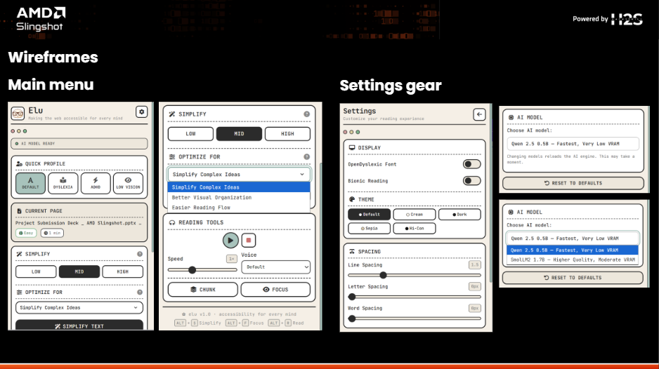
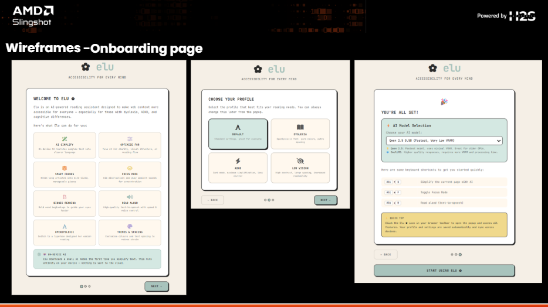
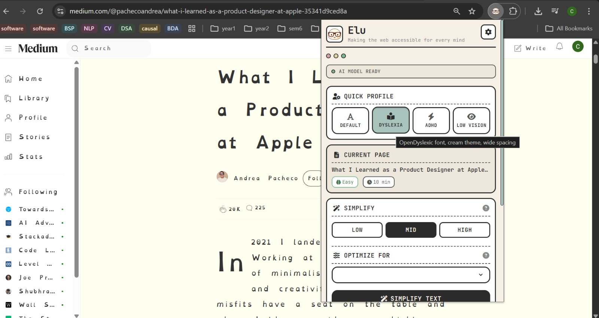
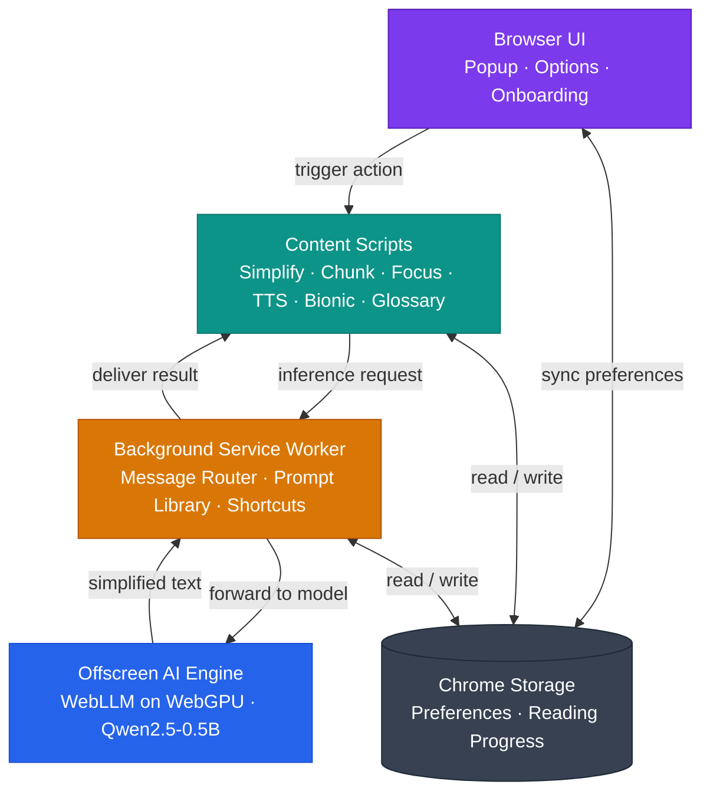
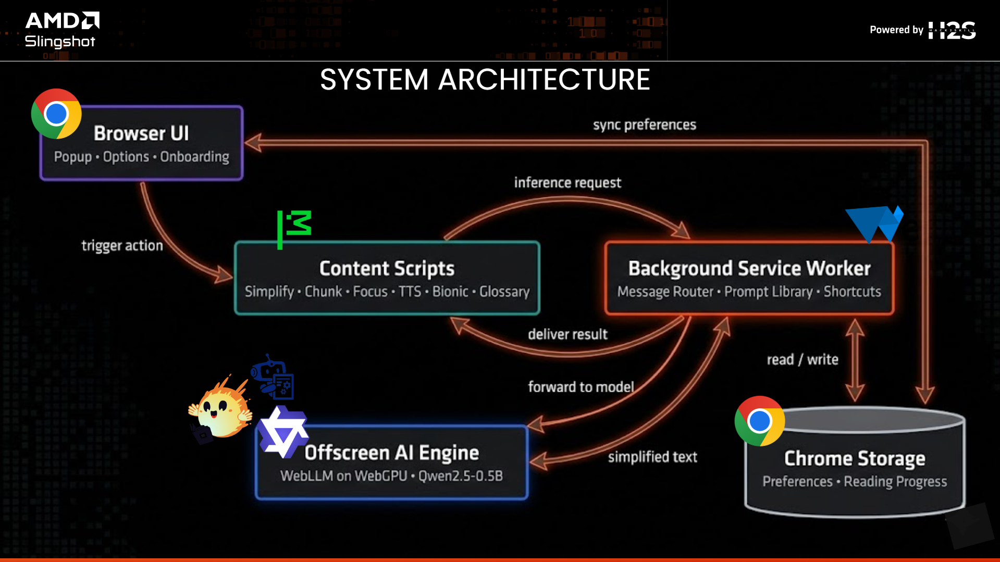
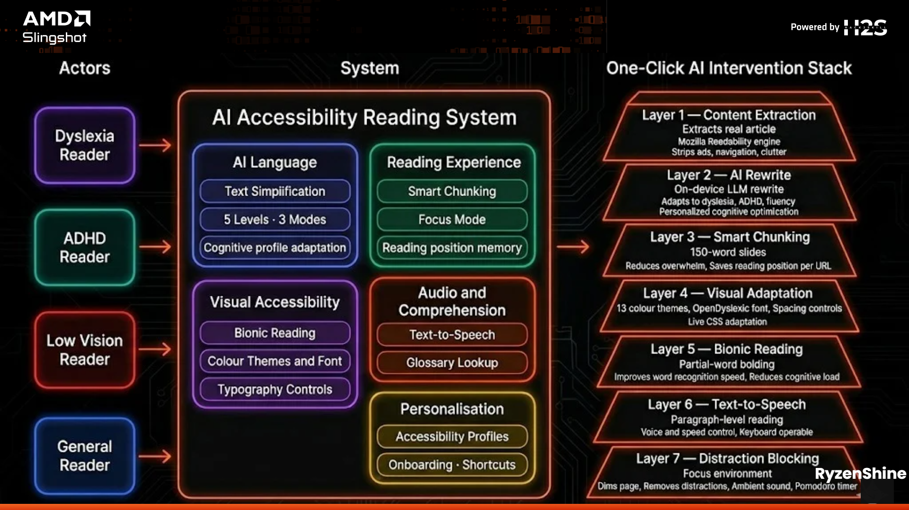
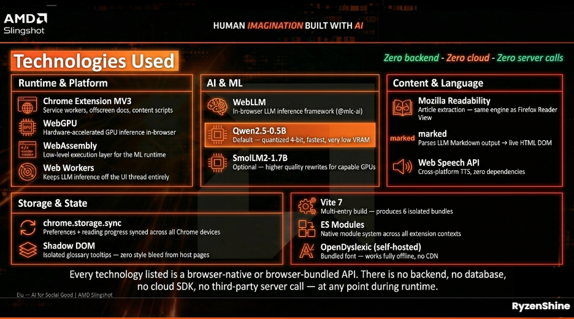
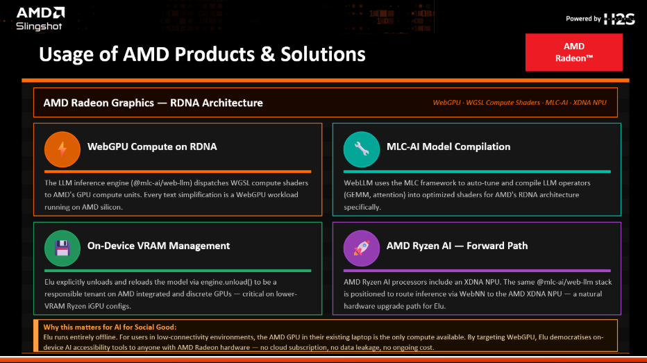

# Elu — AI-Powered Accessible Reading Assistant

<div align="center">
  

  <br/>
  <strong>Making the web readable for every mind.</strong>
  <br/><br/>

  <a href="https://github.com/Sri-Krishna-V/Elu/blob/main/LICENSE">
    
  </a>
  <a href="https://developer.chrome.com/docs/extensions/mv3/">
    
  </a>
  
  
</div>

---

### Popup — Main Menu & Settings



### Onboarding Flow



### Reading Experience



---

> **AMD Slingshot 2026 Submission** — Theme: *AI for Social Good*
> Category: Assistive tools for vision, speech, reading, and neurodiverse learners.

Elu (short for *Elucidate*) is a Chrome extension that transforms any web article into an accessible reading experience — on-device, offline, and privacy-preserving. It runs a quantized large language model directly in the browser using **WebLLM** and **WebGPU**, eliminating the need for cloud APIs or user data transmission.

Elu targets a wide spectrum of cognitive and sensory needs: **dyslexia**, **ADHD**, **low vision**, **language learners**, and anyone who benefits from a calmer, clearer reading environment.

---

### Popup — Main Menu & Settings


### Onboarding Flow


---

## Table of Contents

- [The Problem](#the-problem)
- [Solution Overview](#solution-overview)
- [Architecture](#architecture)
- [Use Cases](#use-cases)
- [Feature Reference](#feature-reference)
- [Accessibility Design Principles](#accessibility-design-principles)
- [Technology Stack](#technology-stack)
- [AMD Hardware Integration](#amd-hardware-integration)
- [Screenshots](#screenshots)
- [Getting Started](#getting-started)
- [Keyboard Shortcuts](#keyboard-shortcuts)
- [Privacy Guarantee](#privacy-guarantee)
- [Contributing](#contributing)
- [License](#license)

---

## The Problem

Approximately **1 in 5 people** has a language-based learning difference such as dyslexia. An estimated **366 million** people worldwide live with ADHD. Countless others navigate the web with low vision, cognitive fatigue, or as non-native speakers. Yet the modern web is built with one reader in mind: a neurotypical adult with perfect vision.

Dense paragraphs, distracting sidebars, autoplay videos, and complex vocabulary create invisible barriers for a significant fraction of the population. Existing assistive tools are either siloed, superficial, or rely on cloud processing that creates privacy risks.

---

## Solution Overview

Elu intercepts the reading experience at the browser level and provides a layered set of interventions:

| Layer | What Elu Does |
|---|---|
| **Language** | Rewrites content to 5 configurable reading levels using an on-device LLM |
| **Cognition** | Breaks articles into 150-word chunks with progress tracking and bookmarks |
| **Focus** | Dims distractions, blocks animations, and provides ambient sound assistance |
| **Vision** | Applies 13 high-contrast colour themes, spacing controls, and OpenDyslexic font |
| **Perception** | Bionic reading (bold-first-half rendering) to guide the eye efficiently |
| **Audio** | Paragraph-by-paragraph text-to-speech with variable speed and voice selection |
| **Comprehension** | Inline glossary via double-click word lookup |

All processing occurs locally. No page content ever leaves the browser.


---

## Architecture





### Key Architectural Decisions

- **Offscreen Document + Web Worker**: The WebLLM engine runs in a dedicated Web Worker inside Chrome's `offscreen` document, keeping WebGPU inference off the UI thread entirely and preventing extension page freezes.
- **Background service-worker as router**: All LLM requests from the content scripts are routed through the background service worker, which manages offscreen document lifecycle, model selection, and exponential-backoff retries.
- **Mozilla Readability for content extraction**: A shared `content-extractor.js` module uses `@mozilla/readability` with a CSS-selector fallback to reliably locate the main article body, independent of page structure.
- **System prompt library**: Three prompt families (`textClarity`, `focusStructure`, `wordPattern`) each with five intensity levels (1–5) provide 15 distinct rewrite personalities delivered from `prompts.js` without duplicating logic in the content layer.
- **`chrome.storage.sync` for settings**: All user preferences are synced across devices at the storage layer; no settings server is required.

---

## Use Cases



---

## Feature Reference

### AI Text Simplification

Elu rewrites page content using a locally running quantized LLM. Three optimization modes address distinct cognitive profiles:

| Mode | Target Profile | Behaviour |
|---|---|---|
| **Text Clarity** (`textClarity`) | General / low reading fluency | Shortens sentences, removes filler, preserves paragraph structure |
| **Focus Structure** (`focusStructure`) | ADHD / attention challenges | Bolds key phrases, limits paragraphs to 1–3 sentences, adds scannable structure |
| **Word Pattern** (`wordPattern`) | Dyslexia / language learners | Enforces Subject-Verb-Object order, replaces idioms, avoids passive voice |

Each mode has **five intensity levels** (1 = light polish → 5 = 1st-grade rewrite), giving 15 distinct rewrite configurations. Levels are configurable globally (3-level compact mode) or with full granularity (5-level mode) via `config.js`.

### Smart Chunking

Long articles are segmented into **150-word chunks** (configurable range: 50–300 words). Each chunk is presented one at a time as a slide, with:

- Visual progress bar and "Chunk X of Y" counter
- Estimated read time per chunk
- Per-chunk bookmark toggle
- "Mark complete" action to track progress
- Session progress persisted in `chrome.storage` by URL — reading position is restored on revisit

### Focus Mode

Focus Mode creates a distraction-free overlay on the current page:

- Configurable dim level for non-article elements
- Automatic hiding of ads, sidebars, comment sections, and related-content panels
- Animation and autoplay video blocking
- Optional ambient sound (brown noise, rain, cafe)
- Built-in Pomodoro-style countdown timer
- Toggle via popup or `Alt+F` keyboard shortcut

### Bionic Reading

A DOM tree-walker processes all visible text nodes and wraps the first half of each word in a `<b>` element with class `bionic-highlight`. This leverages the brain's ability to complete words from partial visual input, reducing cognitive load during scanning. The feature is fully reversible with `removeBionicReading()`.

### Text-to-Speech

The TTS engine uses the Web Speech Synthesis API for cross-platform compatibility:

- Paragraph-level chunking for natural-sounding playback
- Variable playback speed (`tts-set-speed`)
- Voice selection from all system-installed voices (`tts-set-voice`)
- Play, Pause, Resume, Stop controls exposed in the popup
- Accessible via `Alt+R` keyboard shortcut

### Inline Glossary

A `dblclick` listener intercepts word selections across the page. Words present in a common-English dictionary are bypassed; uncommon or domain-specific terms trigger an API call to a dictionary service, with the definition displayed in a Shadow DOM tooltip that is visually non-intrusive and pointer-event isolated.

### Visual Accessibility

| Feature | Detail |
|---|---|
| **13 Colour Themes** | Default, Dark Mode, Sepia, Cream Paper, High Contrast (B/W, Y/K, K/Y), Low Blue Light, Soft Pastel Blue/Green, Grey Scale, Blue Light Filter |
| **OpenDyslexic Font** | Bundled typeface designed to reduce letter-confusion errors common in dyslexia |
| **Line Spacing** | Adjustable 1.0× – 3.0× |
| **Letter Spacing** | Adjustable 0 – 10px |
| **Word Spacing** | Adjustable 0 – 20px |

### Onboarding Profiles

On first install, a guided 3-step onboarding flow lets users self-identify their profile:

| Profile | Pre-configured Settings |
|---|---|
| **Default** | Standard spacing, system font, default theme |
| **Dyslexia** | OpenDyslexic font, Cream Paper theme, elevated line/letter/word spacing |
| **ADHD** | Dark Mode theme, level-5 simplification, moderate spacing |
| **Low Vision** | High Contrast theme, maximum spacing, elevated line height |

Profiles are immediately editable and all settings remain individually adjustable after onboarding.

---

## Accessibility Design Principles

Elu is designed with **inclusion-by-design** values:

- **Screen reader compatibility**: Notifications and status updates use ARIA live regions (`announce()` helper) so screen readers surface state changes without visual focus interruption.
- **Keyboard-first navigation**: All primary functions are operable without a mouse. Global shortcuts (`Alt+S`, `Alt+F`, `Alt+R`) work from anywhere in the browser.
- **Contrast compliance**: High Contrast and High Contrast Alt themes meet WCAG 2.1 AA contrast ratios. Yellow-on-Black and Black-on-Yellow variants meet AAA for users with achromatopsia.
- **Font legibility**: OpenDyslexic is bundled locally — no CDN dependency — ensuring it is available in offline environments.
- **No motion by default**: Focus Mode can suppress CSS animations and autoplay media, respecting users with vestibular disorders.
- **Persistent preferences**: All accessibility settings sync across Chrome profiles via `chrome.storage.sync`, removing the need to reconfigure on each session.
- **Progressive enhancement**: All non-AI features (bionic reading, focus mode, TTS, themes, spacing) function without model initialisation. AI simplification degrades gracefully with a clear "WebGPU not supported" message.

---

## Technology Stack

| Component | Technology |
|---|---|
| Extension platform | Chrome Extension Manifest V3 |
| Build tool | Vite 7 |
| On-device AI | [WebLLM](https://github.com/mlc-ai/web-llm) (`@mlc-ai/web-llm` 0.2.x) via WebGPU |
| Default model | `Qwen2.5-0.5B-Instruct-q4f16_1-MLC` (quantized, ~400 MB) |
| Content parsing | `@mozilla/readability` 0.6 |
| Markdown rendering | `marked` 17 |
| Speech | Web Speech Synthesis API |
| Storage | `chrome.storage.sync` |
| Fonts | OpenDyslexic (self-hosted) |

The extension ships no backend. Inference is delegated to a **Web Worker** running inside a Chrome `offscreen` document, using **WebGPU** for hardware-accelerated matrix operations. The offscreen architecture prevents WebGPU workloads from blocking the extension's UI thread.



---

## AMD Hardware Integration

Elu is designed to run on AMD Radeon hardware using the RDNA architecture's WebGPU compute capabilities. Every text simplification is a WebGPU workload dispatched directly to AMD GPU compute units via WGSL compute shaders.



| Integration | Detail |
|---|---|
| **WebGPU Compute on RDNA** | `@mlc-ai/web-llm` dispatches WGSL compute shaders to AMD GPU compute units for all LLM inference |
| **MLC-AI Model Compilation** | WebLLM uses the MLC framework to auto-tune and compile LLM operators (GEMM, attention) into optimised shaders for RDNA specifically |
| **On-Device VRAM Management** | Elu explicitly unloads and reloads the model via `engine.unload()` to be a responsible tenant on AMD integrated and discrete GPUs — critical on lower-VRAM Ryzen iGPU configs |
| **AMD Ryzen AI — Forward Path** | The same `@mlc-ai/web-llm` stack is positioned to route inference via WebNN to the AMD XDNA NPU, a natural hardware upgrade path for Elu |

> Elu runs entirely offline. For users in low-connectivity environments, the AMD GPU in their existing device is the only compute available. By targeting WebGPU, Elu democratises on-device AI accessibility tools to anyone with AMD Radeon hardware — no cloud subscription, no data leakage, no ongoing cost.

---

## Getting Started

### Prerequisites

| Requirement | Detail |
|---|---|
| Browser | Chrome 116 or later (stable, dev, or canary) |
| GPU | Any modern discrete or integrated GPU with WebGPU support |
| Disk | ~500 MB free space for the model cache |
| OS | Windows, macOS, or Linux |

> Note: WebGPU support can be verified at `chrome://gpu`. Elu detects WebGPU availability at runtime and disables AI features gracefully on unsupported hardware while keeping all other accessibility tools fully functional.

### Installation

**1. Clone and build**

```bash
git clone https://github.com/Sri-Krishna-V/Elu.git
cd Elu
npm install
npm run build
```

For development with hot-reload:

```bash
npm run dev
```

**2. Load the extension**

1. Open `chrome://extensions/`
2. Enable **Developer mode** (toggle, top-right corner)
3. Click **Load unpacked**
4. Select the `dist/` folder produced by the build

**3. Complete onboarding**

The extension opens a guided onboarding page on first install. Select your accessibility profile and preferred AI model, then click **Finish**. The model will cache to disk on first use (one-time download).

---

## Keyboard Shortcuts

| Shortcut | Action |
|---|---|
| `Alt + S` | Simplify the current page |
| `Alt + F` | Toggle Focus Mode |
| `Alt + R` | Toggle Read Aloud (TTS) |

Shortcuts can be remapped in Chrome at `chrome://extensions/shortcuts`.

---

## Privacy Guarantee

- All text processing and AI inference run **entirely on-device** using WebGPU.
- No page content, reading history, or usage analytics are transmitted to any server.
- No account or sign-in is required.
- The extension only requests the minimum permissions required: `activeTab`, `storage`, `scripting`, `tts`, and `offscreen`.
- The source code is fully open and auditable.

---

## Project Structure

```
src/
  background/       # Service worker: routing, lifecycle, keyboard commands
    index.js
    prompts.js      # 15 system prompts (3 modes × 5 levels)
  content/          # Injected into every page
    index.js        # Central message handler and orchestrator
    smart-chunking.js
    focus-mode.js
    bionic.js
    tts.js
    glossary.js
  offscreen/        # WebLLM engine host (WebGPU, Web Worker)
    index.js
    webllm-worker.js
  options/          # Onboarding and settings page
  popup/            # Extension action popup
  common/           # Shared utilities
    content-extractor.js  # Readability + CSS selector extraction
    config.js
    logger.js
    models/
      chunk.js
      focus-config.js
```

---

## Contributing

Contributions are welcome.

1. Fork the repository
2. Create a feature branch: `git checkout -b feature/your-feature`
3. Commit your changes: `git commit -m 'Add your feature'`
4. Push to the branch: `git push origin feature/your-feature`
5. Open a Pull Request

Please ensure any new features maintain the extension's offline-first and privacy-first constraints.

---

## License

Distributed under the MIT License. See [LICENSE](LICENSE) for details.

---

<div align="center">
  Built for the AMD Slingshot 2026 Hackathon &mdash; AI for Social Good<br/>
  <em>Accessible technology is not a feature. It is a right.</em>
</div>
