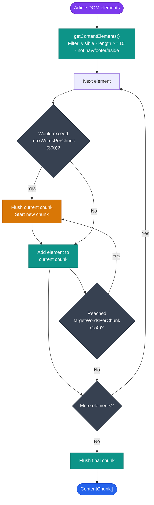

# Smart Chunking

**File:** `src/content/smart-chunking.js`  
**Trigger:** Popup "Chunk" button → `{ action: 'chunk-start' }`

---

## Overview

Smart Chunking breaks long articles into manageable reading slices called **chunks**. Each chunk is presented as a card with a progress indicator, giving readers a clear sense of position and momentum. Reading progress is persisted in `chrome.storage` so users can resume from where they left off.

---

## Chunking Algorithm

The default target is **150 words per chunk** (configurable via `CONFIG` in `smart-chunking.js`).

```
CONFIG.targetWordsPerChunk = 150   (ideal flush point)
CONFIG.minWordsPerChunk    = 50    (minimum before forced flush)
CONFIG.maxWordsPerChunk    = 300   (hard cap)
```

### Element Filtering

Before chunking, `getContentElements()` filters the article's `p, h1–h6, li, blockquote` elements:
- Skips hidden elements (`offsetParent === null`)
- Skips content shorter than 10 characters
- Skips elements inside `nav, footer, aside, .comments, .related`

### Chunk Boundaries

A new chunk is started when:
1. The running word count plus the next element's word count exceeds `maxWordsPerChunk`.
2. The running word count has reached or exceeded `targetWordsPerChunk` after the previous element was added.

Words are counted as `text.trim().split(/\s+/).length`.



---

## Exported Functions

### `initChunking() → Promise<{ chunks, progress } | null>`

1. Extracts article elements via `MAIN_CONTENT_SELECTORS`.
2. Stores a clone of the original content for restoration.
3. Calls `chunkContent(elements)` to produce `ContentChunk[]`.
4. Checks `chrome.storage` for previous progress at the current URL.
5. Restores previous progress if chunk count matches, otherwise creates fresh `ReadingProgress`.

### `renderChunkedView()`

Hides the original article container and replaces it with the Elu chunk card UI:
- Rendered HTML from `chunk.elements`
- Word count and estimated read time (`wordCount / 200` minutes)
- Navigation buttons (Previous / Next)
- Bookmark toggle
- Per-chunk completion checkbox
- Overall progress bar (`completedChunks.length / totalChunks`)

### `goToChunk(index)`

Navigates to a specific chunk index, updates `ReadingProgress.currentChunk`, and saves progress.

### `toggleBookmark()`

Toggles the current chunk index in `ReadingProgress.bookmarks` and saves to storage.

### `completeCurrentChunk()`

Adds the current chunk to `ReadingProgress.completedChunks`, advances to the next chunk, and saves progress.

### `exitChunkedView()`

Removes the chunk UI and restores the original article content.

### `getProgress() → ReadingProgress | null`

Returns the current `ReadingProgress` object.

---

## Progress Persistence

Progress is stored in `chrome.storage.sync` under the key `chunkProgress_<url>`. On revisiting the same URL, the extension detects the stored progress and offers to resume.

The `ReadingProgress` schema includes:
- Current chunk index
- Completed chunk indices
- Bookmarked chunk indices
- Session start time and total read time

See [configuration.md](../configuration.md#readingprogress-schema) for the full schema.

---

## Reading Time Estimate

Each chunk card displays an estimated read time:

```
readTime = Math.ceil(wordCount / 200)  // minutes (200 wpm average)
```

---

## CSS

Chunking UI styles are in `src/content/chunking.css`, which is bundled and injected alongside `content.css`. The slide card and navigation controls use `elu-chunk-*` class names.

---

## Data Model

Chunk objects and progress objects are created by factory functions in `src/common/models/chunk.js`. See [Common Utilities — chunk.js](../modules/common.md#modelsChunkJs).
