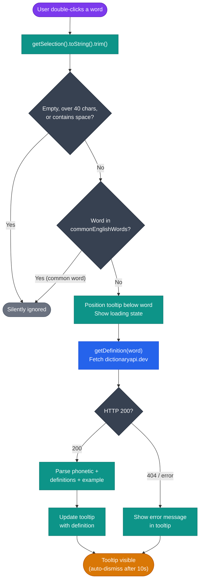

# Inline Glossary

**File:** `src/content/glossary.js`  
**Trigger:** Double-click on any word in the page  
**Initialized by:** `initGlossary()` called from `src/content/index.js` on page load

---

## Overview

The inline glossary intercepts double-click word selections. Common English words are silently bypassed; uncommon or domain-specific terms trigger a definition lookup, displayed in a non-intrusive Shadow DOM tooltip.

---

## Initialization

```js
export function initGlossary() {
    document.addEventListener('dblclick', handleDoubleClick);
}
```

Attaches a single document-level listener. One listener handles all words on the page.

---

## `handleDoubleClick(e)`



1. Reads `window.getSelection().toString().trim()`.
2. Skips if empty, longer than 40 characters, or contains whitespace (multi-word selections).
3. Lowercases and checks against `commonEnglishWords` set — skips common words silently.
4. Gets the selection bounding rect and positions the tooltip below the word.
5. Shows a loading tooltip, then calls `getDefinition(word)`.
6. Updates the tooltip with the returned definition or an error message.

---

## `getDefinition(word) → Promise<string>`

Calls the [Free Dictionary API](https://api.dictionaryapi.dev/api/v2/entries/en/{word}).

Parses the response to extract:
- First phonetic transcription (if available)
- Up to 3 definitions (across all parts of speech)
- An example sentence for the first definition (if available)

Returns a formatted string:

```
word /fəˈnetɪk/

noun: First definition text.

verb: Second definition text.
  "Example sentence here."
```

If the API returns a 404 (word not found), returns `"No definition found for '{word}'."`.  
If the network is unavailable, returns `"Could not load definition."`.

---

## Shadow DOM Tooltip

The tooltip uses a Shadow DOM to prevent page stylesheets from interfering with its appearance:

```
div#elu-glossary-host  (position: absolute, z-index max, pointer-events: none)
  └── ShadowRoot
        ├── <style> (tooltip CSS)
        └── div.tooltip (pointer-events: auto)
              ├── span.term   (word in blue)
              ├── span.phonetic
              └── div.definitions
```

The host element has `pointer-events: none` so it doesn't block clicks on the page. The inner tooltip has `pointer-events: auto` so the user can select and copy the definition text.

### Tooltip Auto-Dismiss

The tooltip is automatically removed after `GLOSSARY_TIMEOUT_MS` (10 seconds). It is also removed on the next double-click event.

---

## Common English Words Dictionary

`src/common/dictionary.js` exports `commonEnglishWords: Set<string>` — approximately 3000 high-frequency words. Words in this set are skipped immediately without an API call.

To extend the bypass list (e.g., to skip domain-specific jargon in a niche deployment), add terms to `dictionary.js`.

---

## Privacy

Only the selected single word is sent to the dictionary API. No page URL, surrounding text, user identity, or context is transmitted. See [Privacy](../privacy.md#dictionary-lookup-glossary-feature).

---

## Accessibility Notes

- The tooltip is keyboard-accessible — developers can extend `initGlossary` to handle keyboard selection events if needed.
- The Shadow DOM ensures the tooltip styling works consistently regardless of the host page's CSS resets.
- The `z-index: 2147483647` (32-bit max) ensures the tooltip is never obscured by page overlays.
