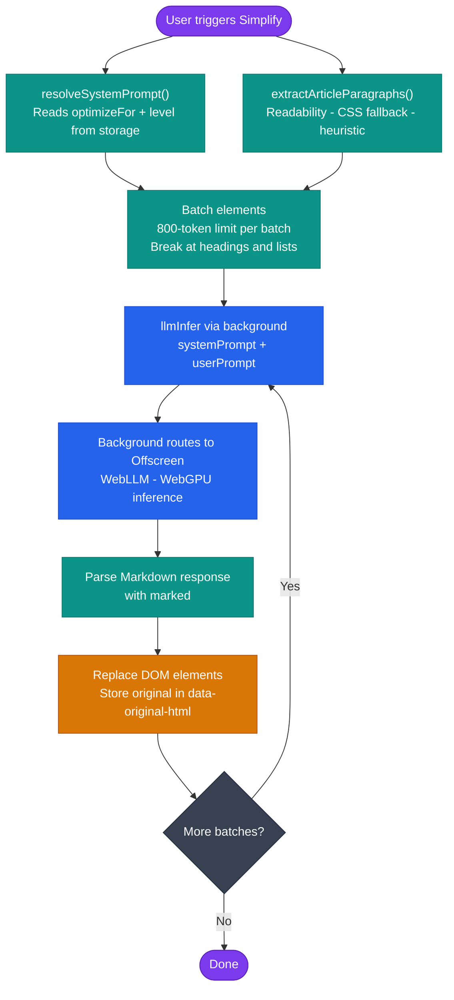

# AI Text Simplification

**Files:** `src/background/prompts.js` · `src/content/index.js` (`simplify` handler)

---

## Overview

Elu rewrites web article content using a locally running quantized LLM (`Qwen2.5-0.5B-Instruct-q4f16_1-MLC`). The rewriting is controlled by two dimensions:

- **Optimization mode** — cognitive target profile (3 options)
- **Intensity level** — rewriting depth (5 levels, or 3 in compact mode)

Together these provide **15 distinct rewrite configurations** without duplicating logic.

---

## Optimization Modes

| Mode key | Target Profile | Strategy |
|---|---|---|
| `textClarity` | General / low reading fluency | Shorter sentences, remove filler, preserve cadence |
| `focusStructure` | ADHD / attention challenges | Bold key phrases, 1–3 sentences per paragraph, scannable layout |
| `wordPattern` | Dyslexia / language learners | Subject-Verb-Object order, replace idioms, avoid passive voice |

---

## Intensity Levels

| Level | Approximate Reading Grade | Typical sentence length |
|---|---|---|
| 1 | Light polish | ≤ 25 words |
| 2 | 8th grade | ≤ 20 words |
| 3 | 5th grade | ≤ 15 words |
| 4 | 3rd grade | ≤ 15 words |
| 5 | 1st grade | ≤ 8 words |

---

## Prompt Library

Defined in `src/background/prompts.js` as a nested object:

```js
systemPrompts[mode][level]  // → string
```

All 15 prompts share the same structural constraints:
- No commentary, introductions, or summaries in output
- Preserve headings and quotes as standalone paragraphs
- Keep proper names, brands, and quoted text unchanged
- Maintain the **same number of paragraphs** as the input
- Separate paragraphs with exactly two newline breaks
- Output the rewritten text only

### `textClarity` prompts

| Level | Style |
|---|---|
| 1 | Clear flow, shorter sentences, remove filler |
| 2 | Common everyday words, active voice, under 20 words per sentence |
| 3 | 5th grade, simple words, abstract ideas with concrete examples |
| 4 | 3rd grade, very simple words, very short sentences, brief bracket explanations for abstract ideas |
| 5 | 1st grade, under 8 words per sentence, one idea per sentence |

### `focusStructure` prompts

| Level | Style |
|---|---|
| 1 | Max 3 short sentences per paragraph, bold one key phrase |
| 2 | Start each paragraph with a bold summary phrase |
| 3 | One clear idea per paragraph, bullet points allowed inside paragraphs |
| 4 | 1–2 sentences per paragraph, bold main idea |
| 5 | Very short sentences, complex sentences broken into `- ` bullet points |

### `wordPattern` prompts

| Level | Style |
|---|---|
| 1 | Active voice, Subject-Verb-Object sentence order |
| 2 | Replace idioms with literal meaning |
| 3 | Avoid passive voice, replace long words |
| 4 | Strict Subject-Verb-Object, ~10 words per sentence |
| 5 | Under 8 words, very simple vocabulary |

---

## Simplification Pipeline



### 1. Prompt Resolution

```js
// src/content/index.js
async function resolveSystemPrompt() {
    const prompts     = await loadSystemPrompts(); // background: getSystemPrompts
    const level       = await getReadingLevel();   // storage: simplificationLevel
    const optimizeFor = await getOptimizeFor();    // storage: optimizeFor
    return prompts[optimizeFor][level];
}
```

### 2. DOM Extraction and Batching

`extractArticleParagraphs()` returns all content elements. These are grouped into batches of ≤ 800 estimated tokens, always breaking at headings and list elements:

```
estimateTokens(text) = word_count × 1.3
```

The 800-token limit leaves room for the system prompt and response within the model's context window.

### 3. Inference

Each batch is sent to the background as:

```js
chrome.runtime.sendMessage({
    action: 'llmInfer',
    systemPrompt, // resolved above
    userPrompt    // batch text joined with '\n\n'
})
```

The background service worker routes this to the offscreen engine (see [Offscreen doc](../modules/offscreen.md)).

### 4. DOM Replacement

For each element in the batch:
1. The original `innerHTML` is saved to `data-original-html`.
2. The LLM response (Markdown) is parsed with `marked`.
3. A replacement div is inserted with the rendered HTML.

Calling **Simplify** again on an already-simplified page first restores all `data-original-html` originals before re-simplifying.

---

## Config: Compact vs. Full Levels

`src/common/config.js`:

```js
export const simplificationLevelsConfig = { levels: 3 }; // or 5
```

When `levels: 3`, the popup shows Low → level 1, Mid → level 3, High → level 5. The underlying prompt still uses the numeric level key.

---

## Graceful Degradation

If WebGPU is unavailable:
- `checkAIStatus` returns `{ status: 'no_webgpu' }`
- Simplification buttons are disabled in the popup with a descriptive tooltip
- All other Elu features remain functional
