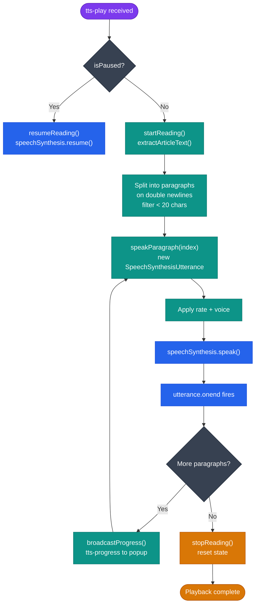

# Text-to-Speech

**File:** `src/content/tts.js`  
**Trigger:** Popup TTS controls · `Alt+R` keyboard shortcut  
**Actions:** `tts-play` · `tts-pause` · `tts-resume` · `tts-stop` · `tts-set-speed` · `tts-set-voice` · `tts-get-state`

---

## Overview

The TTS engine reads the article aloud paragraph-by-paragraph using the **Web Speech Synthesis API**. Playback can be controlled in real time via the popup, and speed and voice are configurable.

---

## Module State

| Variable | Type | Description |
|---|---|---|
| `utterance` | `SpeechSynthesisUtterance \| null` | The active utterance |
| `currentParagraphIndex` | `number` | Index into `paragraphs[]` |
| `paragraphs` | `string[]` | Article text split on double newlines |
| `isPlaying` | `boolean` | Speech synthesis is active |
| `isPaused` | `boolean` | Speech synthesis is paused |
| `currentRate` | `number` | Playback rate (`0.5` – `3.0`) |
| `currentVoiceName` | `string` | Name of the selected voice |

---

## `handleTTSAction(action, options?)`

Dispatcher function called from the content script message handler.

| action | Behaviour |
|---|---|
| `tts-play` | Resumes if paused; otherwise starts from scratch |
| `tts-pause` | Calls `speechSynthesis.pause()` |
| `tts-resume` | Calls `speechSynthesis.resume()` |
| `tts-stop` | Cancels synthesis and resets state |
| `tts-set-speed` | Updates `currentRate`; if playing, cancels and restarts at current paragraph |
| `tts-set-voice` | Updates `currentVoiceName`; if playing, cancels and restarts at current paragraph |

---

## `getTTSState() → object`

Returns `{ isPlaying, isPaused, currentParagraphIndex, totalParagraphs }`.

---

## Playback Pipeline

### `startReading()`

1. Calls `extractArticleText()` to get the article as a plain-text string.
2. Splits on `/\n\n+/` and filters paragraphs shorter than 20 characters.
3. Sets `currentParagraphIndex = 0` and calls `speakParagraph(0)`.

### `speakParagraph(index)`

1. Creates a `SpeechSynthesisUtterance` from `paragraphs[index]`.
2. Sets `utterance.rate = currentRate`.
3. If `currentVoiceName` is set, looks up the matching voice in `speechSynthesis.getVoices()`.
4. `utterance.onend` advances to the next paragraph, broadcasts progress, and calls `speakParagraph(index + 1)`.
5. When all paragraphs are done, calls `stopReading()`.

### `broadcastProgress()`

Sends `chrome.runtime.sendMessage({ action: 'tts-progress', current, total })` so the popup can update a progress indicator.

---

## Voice Selection

Voices are populated from `window.speechSynthesis.getVoices()`. The popup queries this list and presents it as a selector. The selected voice name is stored in module state and applied on the next utterance.

Note: `getVoices()` may return an empty array synchronously on first call. The popup listens for `speechSynthesis.onvoiceschanged` to repopulate.

---

## Speed

| Slider value | `utterance.rate` |
|---|---|
| 0.5× | 0.5 |
| 1.0× | 1.0 (default) |
| 2.0× | 2.0 |
| 3.0× | 3.0 |

---

## Keyboard Shortcut

`Alt+R` toggles TTS (maps to `toggle-tts` command in the manifest → background service worker sends `tts-play` or `tts-stop` depending on `getTTSState().isPlaying`).

---

## Accessibility Notes

- TTS uses the browser's native speech synthesis — it respects the user's system voice preferences.
- Paragraph-level chunking avoids unnatural sentence breaks from the browser's utterance length limits.
- Screen reader users may prefer to disable TTS and use their screen reader instead; TTS is fully opt-in.
