# Getting Started

This guide covers prerequisites, building from source, loading the extension in Chrome, and first-run setup.

```mermaid
flowchart LR
    A(["Clone repo"])
    B["npm install"]
    C["npm run build"]
    D["dist/ folder"]
    E["chrome://extensions\nEnable Developer mode"]
    F["Load unpacked\nselect dist/"]
    G["Onboarding page\nSelect profile + model"]
    H["First Simplify request\nModel downloads once"]
    I(["Fully operational"])

    A --> B --> C --> D --> E --> F --> G --> H --> I

    classDef step    fill:#0D9488,stroke:#0F766E,color:#fff
    classDef chrome  fill:#2563EB,stroke:#1D4ED8,color:#fff
    classDef ai      fill:#D97706,stroke:#B45309,color:#fff
    classDef cap     fill:#7C3AED,stroke:#5B21B6,color:#fff

    class A,B,C,D step
    class E,F chrome
    class G ai
    class H ai
    class I cap
```



---

## Prerequisites

| Requirement | Detail |
|---|---|
| Node.js | ≥ 18 (LTS recommended) |
| Chrome | Version 116 or later (stable, dev, or canary) |
| GPU | Any modern discrete or integrated GPU with WebGPU support |
| Disk | ~500 MB free space for the model cache |
| OS | Windows, macOS, or Linux |

> Verify WebGPU availability at `chrome://gpu`. Elu detects WebGPU at runtime and disables AI features gracefully if unsupported, while keeping all other accessibility tools fully functional.

---

## Clone and Build

```bash
git clone https://github.com/Sri-Krishna-V/Elu.git
cd Elu
npm install
npm run build
```

The production build outputs to `dist/`. The build uses **Vite 7** with multiple entry points:

| Entry | Source |
|---|---|
| `popup` | `src/popup/index.html` |
| `options` | `src/options/index.html` |
| `background` | `src/background/index.js` |
| `content` | `src/content/index.js` |
| `offscreen` | `src/offscreen/index.html` |
| `webllm-worker` | `src/offscreen/webllm-worker.js` |

All output lands in `dist/assets/` as `[name].js`. The `public/` folder (manifest, fonts, images, `content-loader.js`) is copied verbatim.

### Development build (watch mode)

```bash
npm run dev
```

Vite rebuilds incrementally on file changes. Reload the extension manually in `chrome://extensions/` after each rebuild (or use an extension such as [Extensions Reloader](https://chrome.google.com/webstore/detail/extensions-reloader)).

---

## Load the Extension in Chrome

1. Navigate to `chrome://extensions/`
2. Enable **Developer mode** (toggle in the top-right corner)
3. Click **Load unpacked**
4. Select the `dist/` directory

The Elu icon appears in the Chrome toolbar. Pin it for quick access.

---

## First Run — Onboarding

On the first install the background service worker opens the onboarding page automatically:

```
src/options/index.html?onboarding=true
```

The 3-step onboarding flow lets users select a pre-configured accessibility profile:

| Profile | Applied Settings |
|---|---|
| **Default** | Standard spacing, system font, default theme |
| **Dyslexia** | OpenDyslexic font · Cream Paper theme · elevated spacing |
| **ADHD** | Dark Mode theme · level-5 simplification · moderate spacing |
| **Low Vision** | High Contrast theme · maximum spacing · elevated line height |

All settings remain individually adjustable after onboarding via the popup or the options page.

---

## First Simplification Request

On the first call to **Simplify Text** (or `Alt+S`):

1. The background service worker creates the offscreen document.
2. The offscreen document spawns a Web Worker (`webllm-worker.js`).
3. WebLLM downloads `Qwen2.5-0.5B-Instruct-q4f16_1-MLC` (~400 MB) and stores it in the browser's model cache.
4. Subsequent requests use the cached model with no download.

A progress indicator in the popup reflects download and loading state.

---

## Keyboard Shortcuts

| Shortcut | Action |
|---|---|
| `Alt + S` | Simplify the current page |
| `Alt + F` | Toggle Focus Mode |
| `Alt + R` | Toggle Read Aloud (TTS) |

Shortcuts can be remapped at `chrome://extensions/shortcuts`.

---

## Permissions

Elu requests the minimum set of Chrome permissions:

| Permission | Reason |
|---|---|
| `activeTab` | Read and modify the current page |
| `storage` | Persist user preferences across sessions via `chrome.storage.sync` |
| `scripting` | Inject content scripts when triggered by the user |
| `tts` | Expose native TTS from the background worker |
| `offscreen` | Create the offscreen document that hosts the WebLLM engine |

No host permissions beyond `<all_urls>` for content-script injection (standard for accessibility tools).
