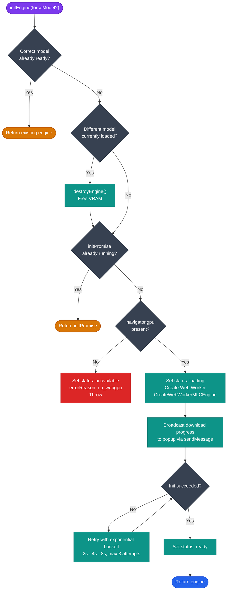

# Offscreen AI Engine

**Location:** `src/offscreen/index.js` · `src/offscreen/webllm-worker.js`  
**Context:** Chrome `offscreen` document — has DOM and can spawn Web Workers with WebGPU.

---

## Why an Offscreen Document?

Chrome MV3 Service Workers cannot use WebGPU or spawn Web Workers. The offscreen document solves both constraints: it is an HTML page (so it has a DOM and Worker API) that Chrome creates and manages in the background, hidden from the user.

---

## index.js — Offscreen Orchestrator

### State

| Variable | Type | Description |
|---|---|---|
| `engine` | `MLCEngineInterface \| null` | The active WebLLM engine instance |
| `currentModel` | `string \| null` | Model ID currently loaded |
| `engineStatus` | `'unavailable' \| 'loading' \| 'ready'` | Engine readiness state |
| `engineErrorReason` | `string` | `'no_webgpu'` or `'init_failed'` or `''` |
| `initPromise` | `Promise \| null` | Prevents concurrent initialization calls |

### Constants

| Name | Value | Purpose |
|---|---|---|
| `DEFAULT_MODEL` | `'Qwen2.5-0.5B-Instruct-q4f16_1-MLC'` | Fallback when no model specified |
| `INIT_MAX_ATTEMPTS` | `3` | Retry limit for engine init |
| `INIT_BACKOFF_BASE_MS` | `2000` | Base delay for exponential backoff |
| `INFERENCE_TIMEOUT_MS` | `180000` | Per-inference timeout (3 minutes) |

### Functions

#### `destroyEngine() → Promise<void>`

Calls `engine.unload()` to free VRAM, then clears `engine`, `currentModel`, and resets `engineStatus` to `'unavailable'`. Safe to call if `engine` is null.

#### `initEngine(forceModel?) → Promise<MLCEngineInterface>`



1. Returns immediately if the correct model is already loaded and ready.
2. Calls `destroyEngine()` if a different model is currently loaded.
3. Guards against re-entrant calls via `initPromise`.
4. Checks `navigator.gpu` — sets `engineErrorReason = 'no_webgpu'` and throws if WebGPU is absent.
5. Creates the engine via `CreateWebWorkerMLCEngine(Worker, model, { initProgressCallback })`.
6. Retries up to `INIT_MAX_ATTEMPTS` times with exponential backoff on failure.
7. Broadcasts progress events to all extension pages during model download.

#### `runInference(systemPrompt, userPrompt) → Promise<string>`

Calls `engine.chat.completions.create()` with `stream: false`, a 2048-token limit, and `INFERENCE_TIMEOUT_MS`. Returns the assistant message content as a string.

### Message Protocol

All inbound messages carry `target: 'offscreen'`. Handled actions:

| action | Behaviour |
|---|---|
| `initEngine` | Calls `initEngine(message.model)`. Responds `{ success: true }` or `{ success: false, error }`. |
| `reloadEngine` | Calls `destroyEngine()` then `initEngine(message.model)`. |
| `llmInfer` | Calls `runInference(systemPrompt, userPrompt)`. Responds `{ success: true, result }` or `{ success: false, error }`. |
| `checkStatus` | Returns `{ success: true, status, errorReason }` immediately (no async). |

---

## webllm-worker.js — Web Worker

```js
import { WebWorkerMLCEngineHandler } from '@mlc-ai/web-llm';
const handler = new WebWorkerMLCEngineHandler();
self.onmessage = (event) => { handler.onmessage(event); };
```

This file is intentionally minimal. `WebWorkerMLCEngineHandler` from `@mlc-ai/web-llm` manages its own `self.onmessage` internally. The relay re-registers it explicitly to satisfy certain browser environments.

The Worker is built in ES module format (`worker.format: 'es'` in `vite.config.js`) to support top-level `await` and ES module imports, which `@mlc-ai/web-llm` requires.

---

## Model Cache

WebLLM caches model weights in the browser's built-in model storage (Origin-Private File System / Cache API). The first inference request triggers a one-time download of ~400 MB. Subsequent page loads reuse the cache; no re-download occurs.

---

## WebGPU Feature Detection

Before attempting initialization, `index.js` checks `navigator.gpu`. If absent:

- `engineStatus` is set to `'unavailable'`
- `engineErrorReason` is set to `'no_webgpu'`
- A progress broadcast is sent with the message `'WebGPU not supported by this browser or GPU'`
- All downstream AI features are disabled gracefully; all other Elu features remain functional

---

## Related

- [Background Service Worker](background.md) — routes messages to the offscreen document
- [Architecture — Why an Offscreen Document](../architecture.md#why-an-offscreen-document)
- [Getting Started — First Simplification Request](../getting-started.md#first-simplification-request)
